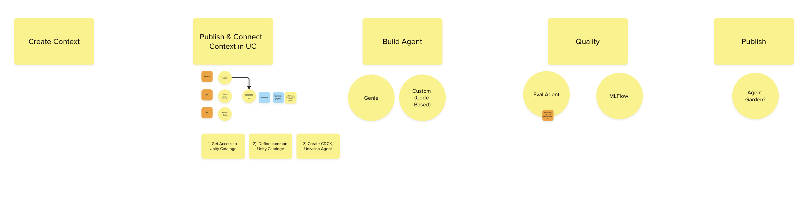

# AI Agent Engineering Roadmap (Enterprise + A2A)
> 6 hours/day minimum · Project-based · Builds on top of `langchain-roadmap.md`
> Goal: understand the **base flows, common tools and methods** of an enterprise agentic project well enough to piece them together on my own.
> Always tag resources so that I can learn to use references while developing.

---

## How this roadmap relates to `langchain-roadmap.md`

- `langchain-roadmap.md` = **how to build the agent's brain** (LLM calls, RAG, tools, LangGraph). It is still the core syllabus.
- This roadmap = **everything around the brain** in a real company project: data/context pipelines, governance (Unity Catalog), multi-agent / A2A, evaluation (Eval Agent, MLflow), CI/CD (GitLab), deployment and reporting (Power BI).
- Modules here are called **AE-xx** (Agent Engineering). LangChain days are called **LC Day x**.
- Where a topic overlaps, the LangChain roadmap teaches the code; this roadmap adds the enterprise layer on top. Nothing is taught twice.

### The lifecycle we are learning (from the team whiteboard)


```text
Create Context → Publish & Connect Context in UC → Build Agent → Quality → Publish
                                                                 ├─ Eval Agent    └─ Agent Garden?
                                                                 └─ MLflow
```

| Whiteboard stage | AE module(s) | LC prerequisite |
|---|---|---|
| Create Context | AE-02 | LC Day 3–4 (indexing), LC Day 7–8 (search) |
| Publish & Connect Context in UC | AE-03 | LC Day 5–6 (retrievers) |
| Build Agent | AE-04, AE-05, AE-06, AE-07 | LC Day 9–10 (tools, LangGraph) |
| Quality (Eval Agent, MLflow) | AE-08 | LC Day 5–6 (structured output for judges) |
| Publish (Agent Garden?) | AE-09 | — |
| (around everything) GitLab repo + CI | AE-01, used in every module after | — |

---

## Combined Timeline (both roadmaps interleaved)

Progress so far: **LC Day 1 done** (chatbot with memory, trimming + summary, `day-01/ex-02.py`).

| Global day | Roadmap | Topic | Work folder |
|---|---|---|---|
| 1–2 | LC Day 1–2 | LangChain foundation (in progress, finish Day 2 mini project) | `day-01/` |
| 3 | AE-00 + AE-01 | Big picture + GitLab repo/CI workflow | `ae-01/` |
| 4–5 | LC Day 3–4 | RAG indexing (loaders, splitters, embeddings, FAISS) | `day-03/` |
| 6 | AE-02 | Create Context the enterprise way (medallion pipeline) | `ae-02/` |
| 7–8 | LC Day 5–6 | Retrieval chain + structured output | `day-05/` |
| 9 | AE-03 | Publish & Connect Context in Unity Catalog | `ae-03/` |
| 10–11 | LC Day 7–8 | Elasticsearch (BM25, kNN, hybrid) — *compressible to 1 day if team is Databricks Vector Search only* | `day-07/` |
| 12–13 | LC Day 9–10 | Tools, ReAct, LangGraph, human-in-the-loop | `day-09/` |
| 14 | AE-04 | Tools at enterprise scale + MCP | `ae-04/` |
| 15 | AE-05 | Build Agent the enterprise way (Databricks Agent Bricks mental model) | `ae-05/` |
| 16 | AE-06 | Multi-agent patterns (supervisor, handoff) in one process | `ae-06/` |
| 17 | AE-07 | A2A — agents talking across services | `ae-07/` |
| 18 | AE-08 | Quality: Eval Agent + MLflow tracing/evaluation + CI eval gate | `ae-08/` |
| 19 | AE-09 | Publish & Operate: deploy, agent registry, monitoring, Power BI | `ae-09/` |
| 20–21 | AE-10 | Capstone: multi-agent Fleet Ops system | `ae-10/` |

Rule of thumb: never start an AE module before its LC prerequisite. Switching focus between roadmaps is fine as long as that rule holds.

---

## Tool Map — what each tool does in the project and what I do instead locally

I can't use most of these tools directly, so every module has a **"Real project"** part (what I'd do with the tool) and a **"Local exercise"** part (a small simulation I can run on my laptop).

| Tool | Role in the project | Local stand-in |
|---|---|---|
| **Databricks** | The platform: notebooks, jobs, Delta tables, Vector Search, model serving, agent hosting | Python scripts + JSON/CSV files + FAISS + Ollama |
| **Unity Catalog (UC)** | Governance registry: names, permissions, lineage for tables, vector indexes, functions (tools), models | A small Python/YAML "fake catalog" module |
| **Databricks Vector Search** | Managed vector index, synced from a Delta table | FAISS (LC Day 3–4) / Elasticsearch (LC Day 7–8) |
| **Agent Bricks / Model Serving** | Hosts the agent as an endpoint, gives model access, memory, tracing | Ollama + running the agent script / a local HTTP server |
| **MLflow** | Tracing every agent step, evaluation runs, versioning agents | **MLflow runs locally for real** (`mlflow ui`) — this one I can actually use |
| **Eval Agent** | LLM-as-judge that scores another agent's answers | A LangChain chain with a grading prompt + Pydantic output |
| **GitLab (repo + CI)** | Source control, merge requests, pipelines: lint → test → eval → deploy | This git repo + a `.gitlab-ci.yml` I write and run the same commands locally |
| **Power BI** | Business dashboards. Connects to Databricks SQL warehouse and reads "gold" tables: agent usage, eval scores, cost, business KPIs. It stores **reports + a semantic model** (measures, relationships, sometimes a cached copy of data) — not the raw data or the agent | A CSV of metrics + a written dashboard spec |
| **Agent Garden** (unconfirmed meaning) | A shared catalog where finished agents are published so other teams/agents can discover and reuse them. Google Cloud also has a product with this exact name (agent samples/templates in Vertex AI Agent Builder) | An `agents_registry.json` listing agent cards |
| **A2A protocol** | Open standard for agents (possibly built with different frameworks/vendors) to discover and call each other over HTTP | Two Python agents running as separate local services |
| **MCP** | Open standard for an agent to connect to **tools and data** (agent ↔ tool). Databricks exposes Genie, Vector Search and UC functions as managed MCP servers | A local MCP server exposing one telemetry tool (optional dependency) |
| **Avalanche** (unconfirmed — ask the team) | Possibly *Avalanche by Trampoline AI*: a Python library that puts agent steps inside typed data-pipeline DAGs. Early release, so double-check it's really what the team meant. Could also be a misheard name or an internal tool | Not needed for exercises until confirmed |

**MCP vs A2A in one line:** MCP = agent talks to a **tool**. A2A = agent talks to another **agent**. Real systems use both.

---

## AE-00: The Big Picture (half day)

**What you will understand after this:**
- The 5-stage lifecycle on the whiteboard and which tool lives at each stage
- The difference between a workflow (fixed steps) and an agent (LLM decides the steps)
- Why enterprises add governance, evaluation and CI around the agent
- Vocabulary: context, tool, MCP, A2A, LLM-as-judge, tracing, medallion, service principal

**Local exercise:** Draw (in markdown) the lifecycle for the Fleet Ops capstone (AE-10) and label which tool is used at each step. Revisit and correct it at the end of the roadmap.

**Resources:**
- [Anthropic — Building effective agents (workflows vs agents, common patterns)](https://www.anthropic.com/engineering/building-effective-agents)
- [Databricks — What is Agent Bricks?](https://developers.databricks.com/docs/agents/overview)

---

## AE-01: Repo + GitLab CI Workflow (half day)

**What you will understand after this:**
- A typical agent project layout (`src/agents`, `src/tools`, `src/context`, `evals/`, `tests/`, `config/`)
- Branch → merge request (MR) → review → merge flow
- `.gitlab-ci.yml`: stages, jobs, scripts, artifacts
- Secrets in CI variables, never in code
- Typical pipeline for an agent project: `lint → unit-test → eval → deploy`

**Real project:** You push a feature branch, open an MR in GitLab, the pipeline runs linting, unit tests for tools, and an eval job that fails the MR if answer quality drops. On merge to `main`, a deploy job (often using Databricks Asset Bundles) deploys jobs/agents to a Databricks workspace. Tokens like `DATABRICKS_TOKEN` live in GitLab CI/CD variables (masked + protected).

**Local exercise:** Write `ae-01/.gitlab-ci.yml` with `lint`, `test`, `eval` stages for this repo. Each job's `script` must be commands you can also run locally (e.g. `python -m py_compile ...`). Run those commands by hand to "simulate" the pipeline.

**Resources:**
- [GitLab CI/CD — Get started](https://docs.gitlab.com/ci/)
- [GitLab — `.gitlab-ci.yml` keyword reference](https://docs.gitlab.com/ci/yaml/)
- [GitLab — CI/CD variables (secrets)](https://docs.gitlab.com/ci/variables/)
- [Databricks Asset Bundles (deploy from CI)](https://docs.databricks.com/aws/en/dev-tools/bundles/)

---

## AE-02: Create Context — Enterprise Data Pipeline (1 day)
**Prerequisite:** LC Day 3–4

**What you will understand after this:**
- Medallion architecture: **bronze** (raw) → **silver** (cleaned) → **gold** (business-ready)
- Where chunking + embedding sits in that pipeline (usually silver → a "chunks" table → vector index)
- Delta tables and scheduled jobs (conceptually)
- Metadata you must keep for later: source, timestamp, owner, document id (needed for citations and lineage)

**Real project:** In a Databricks notebook/job, raw telemetry JSON and PDF manuals land in a bronze table, get cleaned into silver, chunked into a `*_chunks` Delta table, and a Databricks Vector Search index syncs from that table automatically.

**Local exercise:** Build `ae-02/pipeline.py`: `bronze/` raw JSON → `silver/` cleaned JSON (drop bad records, normalise fields) → `chunks.json` with metadata → FAISS index (reuse LC Day 3–4 code).

**Resources:**
- [Databricks — Medallion architecture](https://docs.databricks.com/aws/en/lakehouse/medallion)
- [Databricks — Vector Search](https://docs.databricks.com/aws/en/generative-ai/vector-search)

---

## AE-03: Publish & Connect Context in Unity Catalog (1 day)
**Prerequisite:** LC Day 5–6

**What you will understand after this:**
- UC naming: `catalog.schema.object` (e.g. `main.fleet.telemetry_chunks`)
- What gets registered: tables, volumes (files), vector indexes, functions (usable as agent tools), models
- Permissions with `GRANT`, and why agents run as **service principals** (non-human identities)
- Lineage: being able to trace an answer back to the source table

**Real project:** You register the chunks table and vector index in UC, write a UC function such as `main.fleet.get_vehicle_stats(car_id)`, grant `EXECUTE` to the agent's service principal, and the agent loads that function as a tool. Analysts' Power BI reports read gold tables from the same catalog.

**Local exercise:** Build `ae-03/fake_uc.py`: a registry dict keyed by `catalog.schema.object` with `type`, `description`, `owner`, `allowed_principals`. Add `get_asset(name, principal)` that raises if not allowed. Make your Day 5–6 retriever load its index *through* this registry.

**Resources:**
- [Databricks — Unity Catalog overview](https://docs.databricks.com/aws/en/data-governance/unity-catalog/)
- [Databricks — Connect agents to structured data (UC, Genie, MCP)](https://docs.databricks.com/aws/en/agents/custom-agents/structured-retrieval-tools)

---

## AE-04: Tools at Enterprise Scale + MCP (1 day)
**Prerequisite:** LC Day 9–10

**What you will understand after this:**
- Good tool design: narrow purpose, clear name/description, typed inputs, safe errors
- Read-only vs side-effect tools (side-effect tools usually need human approval)
- MCP: server exposes tools, client (the agent) discovers and calls them
- Why companies prefer shared MCP servers over every agent re-implementing the same tool

**Real project:** Instead of writing your own SQL tool, the agent connects to Databricks managed MCP servers (Genie for tables, Vector Search for documents, UC functions for business logic). Permissions still come from UC.

**Local exercise:** Take your LC Day 9 tools and refactor them: Pydantic input schemas, clear docstrings, error handling that returns a safe message. Optional (adds the `mcp` dependency — ask first): expose one tool via a local MCP server.

**Resources:**
- [Model Context Protocol — docs](https://modelcontextprotocol.io/)
- [LangChain Docs — Tools](https://python.langchain.com/docs/concepts/tools/)

---

## AE-05: Build Agent — Enterprise Style (1 day)
**Prerequisite:** LC Day 9–10, AE-03, AE-04

**What you will understand after this:**
- Separating agent code from config (model name, prompts, tool list, index names)
- Model gateway concept: call models through one governed API so models can be swapped
- Memory: short-term (session) vs long-term (stored facts) — builds on LC Day 1 ex-02
- How a framework-agnostic platform hosts a LangGraph agent

**Real project:** You scaffold an agent with the Databricks Agent Bricks CLI (or bring your LangGraph agent), declare its tools/memory in a manifest, call models via the gateway, run it locally against Databricks, then deploy it as an app/endpoint.

**Local exercise:** Restructure your LC Day 9–10 agent into `ae-05/` with `config.yaml` (or a Python config dict), `agent.py`, `tools.py`, and tools fetched through `fake_uc.py`. Switching the Ollama model must only need a config change.

**Resources:**
- [Databricks — Agent Bricks overview](https://developers.databricks.com/docs/agents/overview)
- [Databricks — Agent Bricks CLI](https://developers.databricks.com/docs/agents/cli)

---

## AE-06: Multi-Agent Patterns in One Process (1 day)
**Prerequisite:** AE-05

**What you will understand after this:**
- Why split into multiple agents (focus, smaller prompts, separate permissions)
- **Supervisor** pattern: one router agent delegates to specialist agents
- **Handoff** pattern: one agent passes control to another
- Shared state vs message passing
- When *not* to go multi-agent (a single agent + good tools is often enough)

**Local exercise:** LangGraph supervisor with 2 specialists: `TelemetryAnalyst` (RAG + stats tools) and `ReportWriter` (formats a report). Supervisor routes based on the question.

**Resources:**
- [LangGraph — Multi-agent systems](https://langchain-ai.github.io/langgraph/concepts/multi_agent/)

---

## AE-07: A2A — Agent-to-Agent Across Services (1 day)
**Prerequisite:** AE-06

**What you will understand after this:**
- Difference from AE-06: agents run as **separate services**, maybe by different teams/frameworks/vendors
- A2A core pieces: **Agent Card** (JSON describing an agent's name, skills, endpoint, auth), **tasks**, **messages**, **artifacts**, streaming/long-running tasks
- Discovery: how one agent finds another (agent cards in a registry — this is where an "Agent Garden" fits)
- Auth between agents (service identities, tokens from env/secret manager)

**Real project:** The Fleet Ops supervisor (team A) discovers the Telemetry Analyst agent (team B, deployed on Databricks) from the agent registry, reads its Agent Card, and sends it a task over A2A. Each agent has its own UC permissions.

**Local exercise:** Run `TelemetryAnalyst` as a local HTTP service (on its own port) that serves an agent card and accepts a task. A second script reads the card and calls it. Start with stdlib `http.server` to see the raw idea; the official `a2a-sdk` is optional (ask before adding).

**Resources:**
- [A2A Protocol — official docs](https://a2a-protocol.org/)
- [A2A — GitHub (spec + samples)](https://github.com/a2aproject/A2A)

---

## AE-08: Quality — Eval Agent + MLflow (1 day)
**Prerequisite:** LC Day 5–6 (structured output), AE-05

**What you will understand after this:**
- **Golden dataset**: questions + expected answers/facts + expected sources
- **LLM-as-judge (Eval Agent)**: scores correctness, groundedness (is it backed by retrieved context?), relevance, safety
- Deterministic checks too: right tool called? valid JSON? latency/cost limits?
- **MLflow tracing**: see every step (prompt, tool call, retrieval) of each run
- **MLflow evaluation**: compare agent versions on the same dataset
- CI eval gate: MR fails if scores drop below a threshold

**Real project:** Every MR in GitLab triggers an eval job that runs the golden dataset against the agent, logs results to MLflow on Databricks, and fails if groundedness < threshold. In production, traces are sampled and scored continuously.

**Local exercise:** In `ae-08/`: 15-question golden set for telemetry, an Eval Agent (LangChain chain + Pydantic score output), run both agent versions (single vs multi-agent), log scores to **local MLflow** (`mlflow ui`), and write `eval_gate.py` that exits non-zero below a threshold (referenced by your AE-01 `.gitlab-ci.yml`). Adding `mlflow` is a new dependency — confirm first.

**Resources:**
- [MLflow — GenAI (tracing + evaluation)](https://mlflow.org/docs/latest/genai/)
- [MLflow — Tracing](https://mlflow.org/docs/latest/genai/tracing/)

---

## AE-09: Publish & Operate (1 day)
**Prerequisite:** AE-07, AE-08

**What you will understand after this:**
- Deployment targets: serving endpoint / app, environments (dev → staging → prod)
- Versioning agents and rolling back
- Agent registry / "Agent Garden": publishing agent cards so others can reuse them
- Monitoring: usage, latency, cost, error rate, eval scores, user feedback
- Where **Power BI** fits: dashboards for business owners built on gold tables of agent metrics + business KPIs

**Real project:** Merge to `main` → GitLab deploy job → agent deployed on Databricks → its card is published to the agent registry. Traces and feedback land in Delta tables → aggregated into gold tables (`agent_daily_usage`, `agent_eval_scores`) in UC → Power BI connects through a Databricks SQL warehouse and shows dashboards to managers.

**Local exercise:** Make the AE-08 runs write a `metrics_gold.csv` (date, agent, version, requests, avg_latency, avg_groundedness). Write `ae-09/powerbi-dashboard-spec.md`: which visuals, which measures, who looks at it, and what decision it supports. Add your agents to `agents_registry.json`.

**Resources:**
- [Microsoft — What is Power BI?](https://learn.microsoft.com/en-us/power-bi/fundamentals/power-bi-overview)
- [Azure Databricks — Connect Power BI](https://learn.microsoft.com/en-us/azure/databricks/partners/bi/power-bi)
- [Google Cloud — Vertex AI Agent Builder (incl. Agent Garden)](https://cloud.google.com/products/agent-builder)

---

## AE-10: Capstone — Fleet Ops Multi-Agent System (2 days)

**Mini Project:** Put the whole whiteboard flow together on car telemetry:

1. **Create Context:** medallion pipeline → chunks → vector index (AE-02)
2. **Publish in UC:** everything accessed through `fake_uc.py` with per-agent permissions (AE-03)
3. **Build Agents:** Supervisor + TelemetryAnalyst (A2A service) + ReportWriter, with a human-approval step before "creating a ticket" (AE-04 → AE-07)
4. **Quality:** golden set + Eval Agent + MLflow + eval gate (AE-08)
5. **Publish:** `.gitlab-ci.yml` covering all stages, registry entries, metrics CSV + Power BI spec (AE-01, AE-09)

Final deliverable: a `ae-10/ARCHITECTURE.md` diagram mapping every file to a whiteboard stage and the real tool it simulates.

---

## Questions to ask the team (fill in as you learn)

- [ ] Which cloud: Azure, AWS or GCP? (affects Databricks docs path and Power BI connection)
- [ ] Is "Agent Garden" Google's product or an internal agent registry name?
- [ ] What is "Avalanche" in our project? (Trampoline AI's library, another tool, or a misheard name?)
- [ ] Which agent framework: LangGraph, OpenAI Agents SDK, Google ADK, or Databricks Agent Bricks templates?
- [ ] Is Elasticsearch still used, or only Databricks Vector Search?
- [ ] Is A2A between our own agents only, or with other teams'/vendors' agents?
- [ ] What does Power BI show today: business KPIs only, or also agent metrics?

---

## What to ignore for now

- Fine-tuning / training models
- Kubernetes and infra-as-code details (Terraform) — just know deployment exists
- Deep Spark optimisation — only know Spark/Delta concepts at a "what it is" level
- Building your own vector database or auth system
